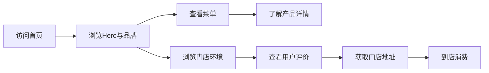

## 1. 产品概述

「晨光咖啡」是一家精品独立咖啡厅的官方网站，致力于呈现温暖优雅的咖啡文化，为用户提供线上菜单浏览、品牌故事了解和门店信息查询服务。
- 目标用户：咖啡爱好者、城市白领、追求生活品质的年轻群体
- 产品价值：传递精品咖啡文化，提升品牌形象，促进到店消费

## 2. 核心功能

### 2.1 功能模块

1. **首页**：Hero 视觉区、导航栏、特色咖啡展示、品牌故事、精选菜单、门店环境、用户评价、联系方式
2. **菜单页面**：咖啡分类、甜点分类、轻食分类、产品详情卡片
3. **关于我们**：品牌故事、咖啡理念、团队介绍

### 2.3 页面详情

| 页面名称 | 模块名称 | 功能描述 |
|-----------|-------------|---------------------|
| 首页 | Hero 视觉区 | 全屏背景图 + 品牌标语 + 滚动提示，入场淡入动画 |
| 首页 | 导航栏 | 固定顶部，滚动时背景渐变，悬停下划线动画 |
| 首页 | 特色咖啡 | 3款招牌咖啡横向卡片布局，悬停放大效果 |
| 首页 | 品牌故事 | 左右分栏图文布局，交错入场动画 |
| 首页 | 精选菜单 | 6款人气产品网格展示，价格与标签 |
| 首页 | 门店环境 | 环境图片瀑布流/网格布局，悬停放大 |
| 首页 | 用户评价 | 横向滚动评价卡片，自动轮播 |
| 首页 | 联系方式 | 地址、营业时间、电话、地图占位 |
| 菜单页面 | 分类标签 | 咖啡/甜点/轻食分类切换，滑动指示器 |
| 菜单页面 | 产品列表 | 产品卡片网格，图片+名称+价格+描述 |
| 关于我们 | 品牌故事 | 大段文字配合图片，分章节呈现 |
| 关于我们 | 咖啡理念 | 图标+文字的特色亮点展示 |

## 3. 核心流程

用户访问官网 → 浏览首页 Hero 与品牌介绍 → 查看菜单了解产品 → 浏览门店环境与用户评价 → 获取地址信息 → 到店消费

## 4. 用户界面设计

### 4.1 设计风格

**整体风格：温暖优雅 · 精品质感 · 复古与现代融合**

- **主色调**：深咖啡棕色 `#3D2314`（品牌主色，用于导航、标题、重要按钮）
- **辅助色**：
  - 奶油米色 `#F5E6D3`（背景底色，营造温暖感）
  - 焦糖金色 `#C49A6C`（点缀色，用于强调、装饰线条）
- **强调色**：
  - 深棕色 `#2C1810`（深色背景区）
  - 暖金色 `#D4A574`（按钮悬停、装饰）
- **文字色**：
  - 标题色 `#2C1810`
  - 正文色 `#5C4033`
  - 浅色文字 `#F5E6D3`（深色背景上）

**字体选择**：
- 标题字体：Playfair Display（优雅衬线字体，传递精品感）
- 正文字体：Lora（可读性强的衬线字体，与标题呼应）
- 装饰字体：Cormorant Garamond（用于大标语、装饰性文字）

**按钮风格**：
- 主按钮：深棕色背景 + 金色细边框 + 圆角 4px + 悬停时轻微上浮 + 金色光泽扫过
- 次按钮：透明背景 + 棕色边框 + 悬停填充棕色背景

**布局风格**：
- 顶部固定导航栏，半透明玻璃质感
- 大区块分节，每节有明确的视觉重心
- 大量留白与精致的排版层次
- 装饰性分割线（金色细线、咖啡渍图案）

**图标风格**：
- 简约线性图标，棕色描边
- 咖啡相关的装饰性插画元素

### 4.2 页面设计概览

| 页面名称 | 模块名称 | UI 元素 |
|-----------|-------------|-------------|
| 首页 | Hero 视觉区 | 全屏咖啡背景图（叠加深色渐变）、白色大标题（Playfair Display）、副标题、向下滚动指示箭头、淡入动画 |
| 首页 | 导航栏 | 左侧 Logo（图形+文字）、右侧导航链接（首页/菜单/关于我们）、悬停下划线动画、滚动时背景从透明变为棕色半透明 |
| 首页 | 特色咖啡 | 米色背景、三列卡片布局、每款咖啡图片+名称+一句话描述、悬停卡片上浮+阴影加深 |
| 首页 | 品牌故事 | 深棕色背景区、左侧文字（浅色）、右侧图片（圆角装饰）、金色装饰线、交错入场 |
| 首页 | 精选菜单 | 米色背景、2x3 网格、产品卡片（图片+名称+价格+小标签）、悬停图片放大 |
| 首页 | 门店环境 | 深棕色背景、不规则图片网格（masonry风格）、图片叠加金色边框 |
| 首页 | 用户评价 | 米色背景、横向滚动卡片、评价内容+头像+姓名+星级、自动轮播 |
| 首页 | 联系方式 | 深棕色背景、左侧信息（地址/时间/电话图标+文字）、右侧地图占位 |
| 菜单页面 | 分类标签 | 顶部固定分类栏、三个分类按钮、选中状态下划线、滑动切换动画 |
| 菜单页面 | 产品列表 | 响应式网格（桌面3列/平板2列/手机1列）、产品卡片精美排版 |
| 关于我们 | 品牌故事 | 大段文字配合穿插图片、分章节（起源/理念/发展）、优雅的首字母下沉 |
| 关于我们 | 咖啡理念 | 4个特色图标+文字（精选豆子/手工烘焙/专业冲煮/温馨环境） |

### 4.3 响应式设计

- **设计策略**：桌面端优先，向下适配平板和手机
- **断点设置**：
  - 桌面端：≥ 1200px（最大宽度 1200px 居中）
  - 平板端：768px - 1199px（网格调整为 2 列）
  - 手机端：< 768px（单列布局，汉堡菜单）
- **移动端优化**：
  - 导航变为汉堡菜单，点击滑出
  - Hero 文字字号缩小，确保可读性
  - 产品卡片改为单列
  - 按钮尺寸增大，便于触控
  - 横向滚动区域支持触摸滑动

### 4.4 动效设计

- **页面入场**：各区块交错淡入上浮（staggered reveal）
- **滚动触发**：元素进入视口时触发动画
- **悬停效果**：按钮上浮、卡片阴影加深、图片轻微缩放
- **导航滚动**：滚动时导航栏背景渐变出现
- **页面切换**：淡入淡出过渡
- **图片加载**：模糊占位 → 清晰图片的渐进式加载
