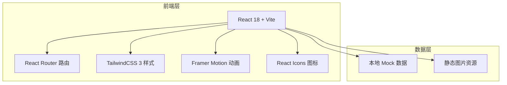

## 1. 架构设计



## 2. 技术描述

- **前端框架**：React@18 + Vite@5
- **样式方案**：TailwindCSS@3
- **路由管理**：React Router DOM@6
- **动画库**：Framer Motion@11
- **图标库**：React Icons（使用 Lucide 风格图标）
- **初始化工具**：Vite 官方脚手架
- **后端**：无（纯静态前端展示站点）
- **数据**：本地 Mock 数据（菜单、评价、门店信息等）

## 3. 路由定义

| 路由路径 | 页面组件 | 页面用途 |
|-------|---------|---------|
| `/` | HomePage | 首页 - 品牌展示、特色咖啡、精选菜单、门店环境、用户评价、联系方式 |
| `/menu` | MenuPage | 菜单页面 - 咖啡/甜点/轻食分类展示 |
| `/about` | AboutPage | 关于我们 - 品牌故事、咖啡理念、团队介绍 |

## 4. 项目目录结构

```
src/
├── components/          # 可复用组件
│   ├── Navbar.jsx       # 导航栏
│   ├── Footer.jsx       # 页脚
│   ├── Hero.jsx         # Hero 区域
│   ├── MenuCard.jsx     # 菜单卡片
│   ├── TestimonialCard.jsx  # 评价卡片
│   └── SectionTitle.jsx     # 区块标题
├── pages/               # 页面组件
│   ├── HomePage.jsx     # 首页
│   ├── MenuPage.jsx     # 菜单页
│   └── AboutPage.jsx    # 关于我们
├── data/                # Mock 数据
│   ├── menu.js          # 菜单数据
│   ├── testimonials.js  # 评价数据
│   └── gallery.js       # 门店环境图
├── styles/              # 全局样式
│   └── index.css        # Tailwind 入口 + 自定义样式
├── App.jsx              # 应用入口
└── main.jsx             # React 挂载点
```

## 5. 数据模型

### 5.1 菜单项数据结构

```javascript
{
  id: number,
  name: string,           // 产品名称
  nameEn: string,         // 英文名称
  price: number,          // 价格（元）
  category: 'coffee' | 'dessert' | 'light',  // 分类
  description: string,    // 产品描述
  image: string,          // 图片 URL
  tag?: string,           // 标签（如"招牌"、"新品"）
  isHot?: boolean         // 是否热门
}
```

### 5.2 用户评价数据结构

```javascript
{
  id: number,
  name: string,           // 用户姓名
  avatar: string,         // 头像 URL
  rating: number,         // 评分（1-5）
  content: string,        // 评价内容
  date: string            // 评价日期
}
```

### 5.3 门店环境图数据结构

```javascript
{
  id: number,
  url: string,            // 图片 URL
  alt: string,            // 图片描述
  width: number,          // 宽度比例
  height: number          // 高度比例
}
```

## 6. 技术选型说明

- **React 18**：组件化开发，生态成熟，便于维护和扩展
- **Vite**：极速开发体验，热更新快，构建效率高
- **TailwindCSS 3**：原子化 CSS，快速构建精美界面，自定义主题方便
- **Framer Motion**：强大的 React 动画库，轻松实现滚动触发、入场动画等效果
- **React Router DOM**：单页应用路由管理，页面切换流畅
- **React Icons**：丰富的图标资源，支持多种图标风格
- **纯前端方案**：咖啡厅官网以展示为主，无需后端服务，部署简单，性能优秀
